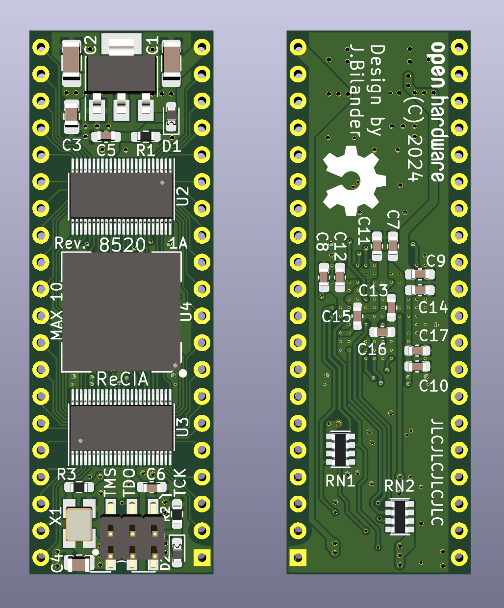
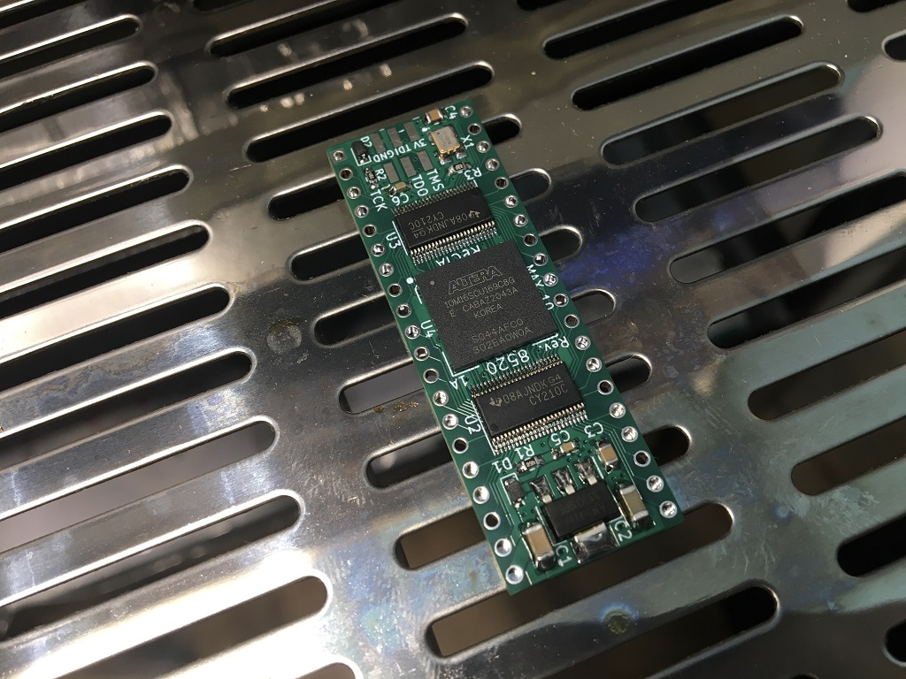
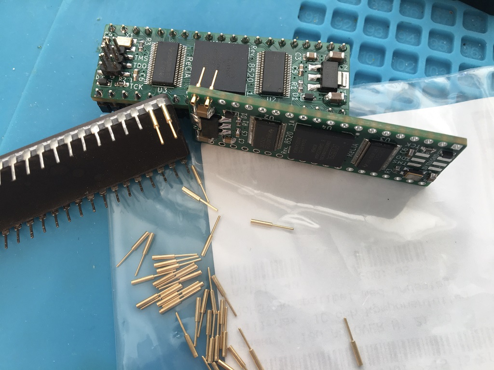
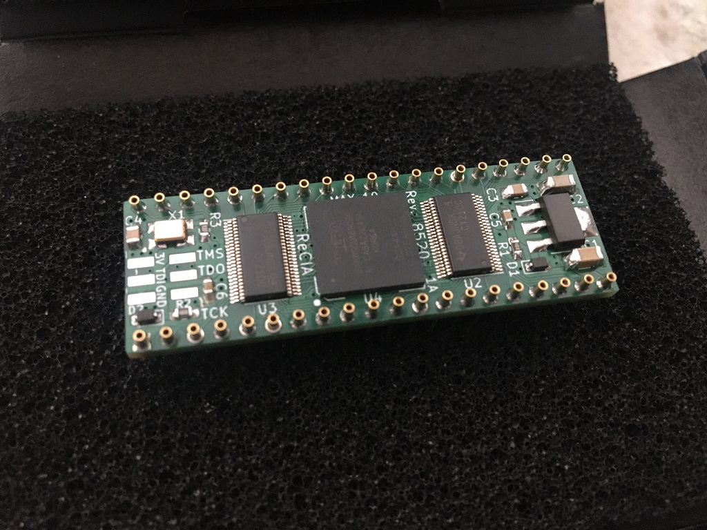
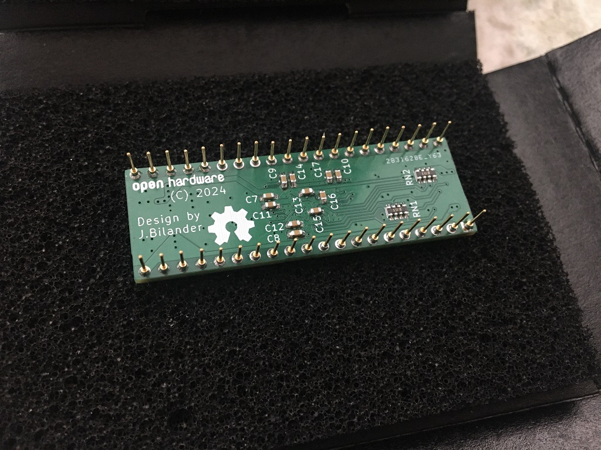
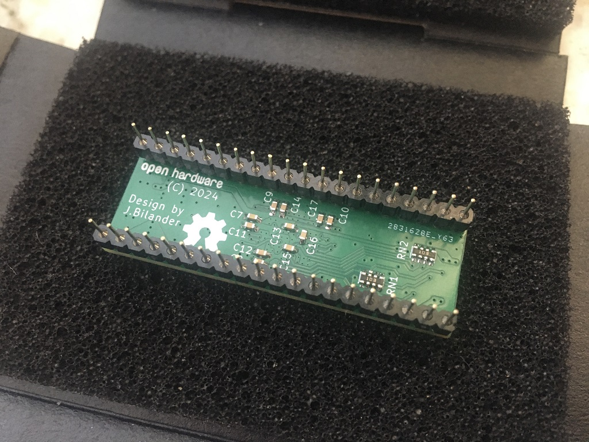
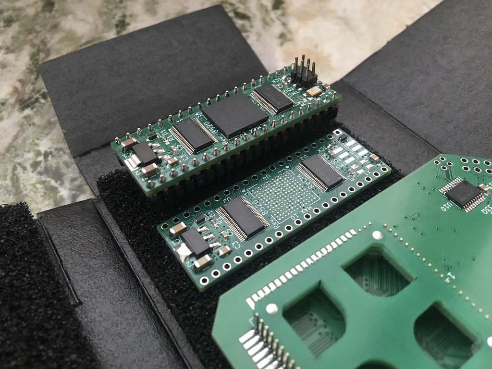
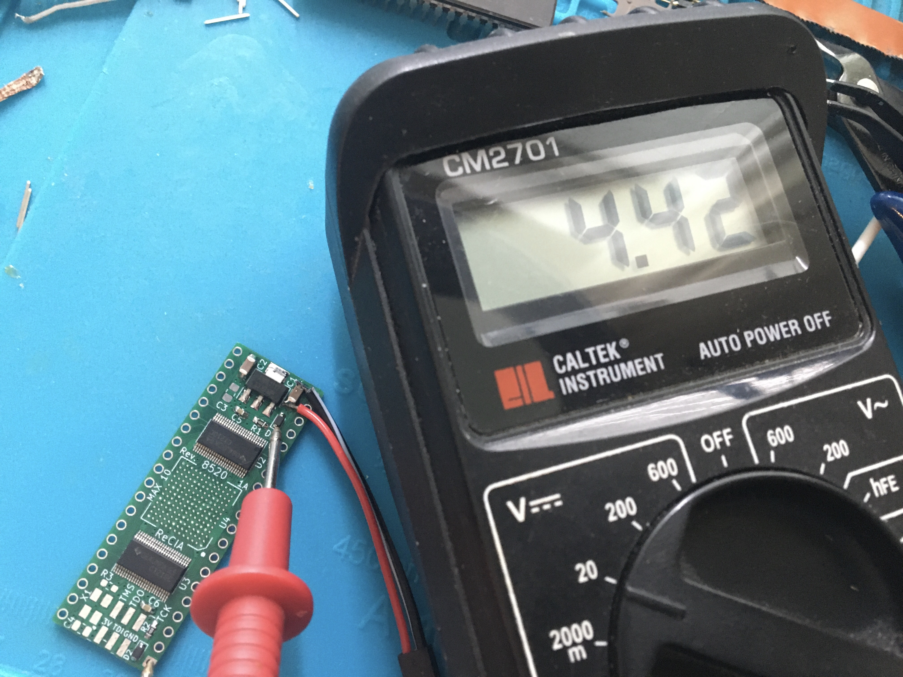
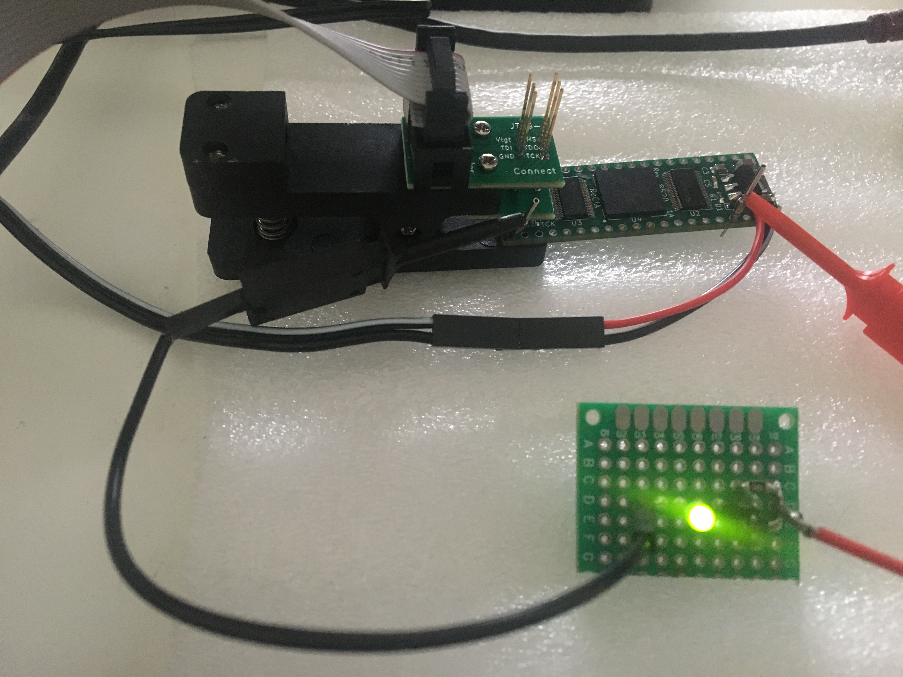

# ReCIA
A drop in replacement CIA (8520) for old Amiga Computers

This is WORK IN PROGRESS. If you generate gerbers and order PCBs from this source you are doing so completely at your own risk!.

Current design is based on an intel/altera 10 Max FPGA but this is mostly so we can signal tap and record how a real 8520 behaves.
The oscillator on board is 10 MHz and the PLL on the Max 10 can take this clock and make a perfect 28.375 MHz or a 28.636 MHz clock signal which will be nice to base the logic on instead of the E-CLK.

The final design will probably target a `LCMXO2-640HC-4SG48C` FPGA or a microcontroller such as `AVR128DA64` or a `RP2350`.

When the DIP-version is functional a PLCC-version (for big box Amigas) can be made.

***

 

 

 

***
